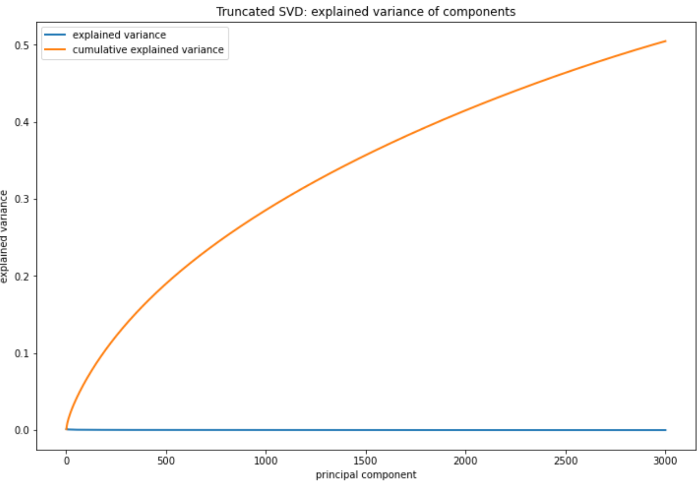
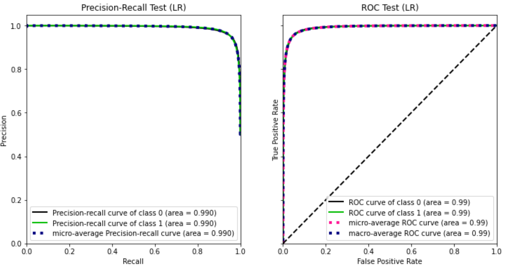

# Predicting the Sentiment of Yelp reviews


## Abstract (tl;dr:)

Five-week final project for my General Assmebly immersive programme. Project involved using the [Yelp dataset](https://www.yelp.com/dataset/documentation/main) to classify restaurant reviews as positive or negative based on their content. I used a number of different natural language processing (NLP) techniques including, stemming, count vectorising and term frequency - indirect document frequency (TFIDF), along with Logistic Regression modelling. The result was an extremely accurate model (accuracy and recall scores of 0.95) which I could then use to analyse reviews from individual restaurants to understand what aspects matter most to people. 

The code for this project can be found [here](https://nbviewer.jupyter.org/github/markjpjones/projects/blob/master/yelp%20sentiment%20analysis/Yelp%20sentiment%20code.ipynb).


## Project Overview

This project was undertaken as part of my study for the General Assembly Data Science Immersive. My aim for the project was two-fold. First, I wanted to gain experience following a typical data science workflow. Second, I wanted to practice using various tools and techniques to tackle a problem requiring natural language processing.


### The Problem

Resturants predominately receive feedback via online reviews posted on Google, Yelp and other portals. While it is easy for resturants to see thier average star rating (and a breakdown of how this reating was calculated), it is impossible for them to understand the reason for ratings (i.e., what people liked/disliked about their dining experience). The only way they can do this currently is by manuallly reading reviews posted by customers, which is both time-consuming and impractical if the number of reviews is large.  Owners could alleviate this problem by reading only a sample of reviews but the danger here is that they miss important feedback. 

With this in mind, I wanted to develop a model that would make it easy for resturant owners to analyse customer reviews. Specifically, allowing them to understand how sentiment relates to the star ratings, and what aspects customers liked/disliked about their dining experience. 

For this project, I chose to the use the [Yelp Dataset](https://www.yelp.com/dataset). This dataset cotains 8M+ reviews and I provide a comprehensive overview of it in the next section.


## Dataset Overview

As mentioned previously, I chose to use review data from [Yelp](https://www.yelp.com/dataset) for this project. This data set contained the following pieces of information:

- **8,021,122** reviews
- **209,393** businesses
- **1,320,761** tips 
- **1,968,703** users

The businesses contained in the data set reside in **10** metropolitan areas in North America.

The data is stored as five JSON files that provide details of businesses, users, reviews, tips and check-ins. The following diagram  shows how the different sets of data are related, with a description of each provided afterwards. 

<p align="center">
	
</p>

### **Business**

Provides information about the businesses being reviewed on Yelp. 

```
{
    // string, 22 character unique string business id
    "business_id": "tnhfDv5Il8EaGSXZGiuQGg",

    // string, the business's name
    "name": "Garaje",

    // string, the full address of the business
    "address": "475 3rd St",

    // string, the city
    "city": "San Francisco",

    // string, 2 character state code, if applicable
    "state": "CA",

    // string, the postal code
    "postal code": "94107",

    // float, latitude
    "latitude": 37.7817529521,

    // float, longitude
    "longitude": -122.39612197,

    // float, star rating, rounded to half-stars
    "stars": 4.5,

    // integer, number of reviews
    "review_count": 1198,

    // integer, 0 or 1 for closed or open, respectively
    "is_open": 1,

    // object, business attributes to values. note: some attribute values might be objects
    "attributes": {
        "RestaurantsTakeOut": true,
        "BusinessParking": {
            "garage": false,
            "street": true,
            "validated": false,
            "lot": false,
            "valet": false
        },
    },

    // an array of strings of business categories
    "categories": [
        "Mexican",
        "Burgers",
        "Gastropubs"
    ],

    // an object of key day to value hours, hours are using a 24hr clock
    "hours": {
        "Monday": "10:00-21:00",
        "Tuesday": "10:00-21:00",
        "Friday": "10:00-21:00",
        "Wednesday": "10:00-21:00",
        "Thursday": "10:00-21:00",
        "Sunday": "11:00-18:00",
        "Saturday": "10:00-21:00"
    }
}
```


### **User**

Provides information on the users who write reviews about businesses.

```
{
    // string, 22 character unique user id, maps to the user in user.json
    "user_id": "Ha3iJu77CxlrFm-vQRs_8g",

    // string, the user's first name
    "name": "Sebastien",

    // integer, the number of reviews they've written
    "review_count": 56,

    // string, when the user joined Yelp, formatted like YYYY-MM-DD
    "yelping_since": "2011-01-01",

    // array of strings, an array of the user's friend as user_ids
    "friends": [
        "wqoXYLWmpkEH0YvTmHBsJQ",
        "KUXLLiJGrjtSsapmxmpvTA",
        "6e9rJKQC3n0RSKyHLViL-Q"
    ],

    // integer, number of useful votes sent by the user
    "useful": 21,

    // integer, number of funny votes sent by the user
    "funny": 88,

    // integer, number of cool votes sent by the user
    "cool": 15,

    // integer, number of fans the user has
    "fans": 1032,

    // array of integers, the years the user was elite
    "elite": [
        2012,
        2013
    ],

    // float, average rating of all reviews
    "average_stars": 4.31,

    // integer, number of hot compliments received by the user
    "compliment_hot": 339,

    // integer, number of more compliments received by the user
    "compliment_more": 668,

    // integer, number of profile compliments received by the user
    "compliment_profile": 42,

    // integer, number of cute compliments received by the user
    "compliment_cute": 62,

    // integer, number of list compliments received by the user
    "compliment_list": 37,

    // integer, number of note compliments received by the user
    "compliment_note": 356,

    // integer, number of plain compliments received by the user
    "compliment_plain": 68,

    // integer, number of cool compliments received by the user
    "compliment_cool": 91,

    // integer, number of funny compliments received by the user
    "compliment_funny": 99,

    // integer, number of writer compliments received by the user
    "compliment_writer": 95,

    // integer, number of photo compliments received by the user
    "compliment_photos": 50
}
```


### **Reviews**

Contains the reviews written by users about businesses. Only the reviews that were recommended by Yelp at the time of data collection are included. 

```
{
    // string, 22 character unique review id
    "review_id": "zdSx_SD6obEhz9VrW9uAWA",

    // string, 22 character unique user id, maps to the user in user.json
    "user_id": "Ha3iJu77CxlrFm-vQRs_8g",

    // string, 22 character business id, maps to business in business.json
    "business_id": "tnhfDv5Il8EaGSXZGiuQGg",

    // integer, star rating
    "stars": 4,

    // string, date formatted YYYY-MM-DD
    "date": "2016-03-09",

    // string, the review itself
    "text": "Great place to hang out after work: the prices are decent, and the ambience is fun.",

    // integer, number of useful votes received
    "useful": 0,

    // integer, number of funny votes received
    "funny": 0,

    // integer, number of cool votes received
    "cool": 0
}
```


### **Tips**

Recommendations provided by users about businesses. Tips are shorter than reviews and tend to convey quick suggestions. For example, what secret menus to ask for, etc..

```
{
    // string, text of the tip
    "text": "Secret menu - fried chicken sando is da bombbbbbb Their zapatos are good too.",

    // string, when the tip was written, formatted like YYYY-MM-DD
    "date": "2013-09-20",

    // integer, how many compliments it has
    "compliment_count": 172,

    // string, 22 character business id, maps to business in business.json
    "business_id": "tnhfDv5Il8EaGSXZGiuQGg",

    // string, 22 character unique user id, maps to the user in user.json
    "user_id": "49JhAJh8vSQ-vM4Aourl0g"
}
```


### **Check-ins**

For each business, a list of user check-ins that have occurred.

```
{
    // string, 22 character business id, maps to business in business.json
    "business_id": "tnhfDv5Il8EaGSXZGiuQGg"

    // string which is a comma-separated list of timestamps for each checkin, each with format YYYY-MM-DD HH:MM:SS
    "date": "2016-04-26 19:49:16, 2016-08-30 18:36:57, 2016-10-15 02:45:18, 2016-11-18 01:54:50"
}
```


## Data Preparation

When starting this project, the biggest challenge I faced was the size of the json files. In total, the files were 9.8GB in size, which was far too big to work with directly in Pandas. In the next section I describe how I approached working with the data and what assumptions I made. I then go on describe how I created features from the data that I could use for modelling.


### Data Loading & Exploration

Given the data set was too large to work with directly in Pandas, I chose to upload it to a Postgres database to work with. I did this by first splitting the json files into smaller junks and then iteratively loading these smaller chunks into a Pandas Dataframe, which I could then write to Postgres. I created one table in Postgres for each json file (business, reviews, tips, check-ins, users). [This article](https://blog.softhints.com/python-read-huge-json-file-pandas/) provides an excellent overview of the approach I took for chunking and loading the JSON files. The code I created for loading data into a Dataframe and then out to Postgres can be found [here](https://nbviewer.jupyter.org/github/markjpjones/projects/blob/master/yelp%20sentiment%20analysis/Yelp%20sentiment%20code.ipynb#Data-Loading-(JSONs)-).

During the data exploration my aim was to ensure that I had quality data to use for modelling. I split my exploration into five stages. Each of which I will now describe.


#### Filter out reviews not linked to restaurants

As my goal was to help restaurants better understand their reviews it makes sense to exclude reviews for businesses that are not restaurants. Yelp allows businesses to be categorised quite broadly (and businesses are allowed to have more than category). In this regard the categories are more like tags. Yelp has 1,337 keywords for descrbing/categorising businesses. The most popular tags are shown below.

<p align="center">
	
</p>

Excluding non-resturants businessses from my dataset caused the number of businesses to drop from ~209K to ~63K (a 60% drop), and a subsequent ~38% reduction in the with the number of reivews being considered. 

While the amount of data being excluded may seem like a lot, it is completely justified to ensure relevant insights can be provided to restaurants. If I did not exclude non-restaurant businesses then the accuraccy of my model (predictions) would suffer as it's ability to predict setiment of resturants reviews would be hampered/diluted by the feedback from all other business reviews.

The code used for this analysis can be found <a href="sql/restaurant reviews.sql">here</a>.


#### Filter out short reviews or reviews without alphabetical characters

With business (and review) data now filtered to only those for resturants. I next focussed on only keeping reviews that would provide useful insights for restaurants relating to customer sentiment and feedback. My first step was to exclude reviews that were extremely short or did not conatin alphebetcical characters. My rationale for doing this was that in both cases the reviews would not be provide any insights as to why customers rated resaurants in certain ways. 

Looking at the number of words in a reivew makes it hard to pinpoint any potential issues as a one or two word review are perfectly legitimate, and would provide feedback on sentiment. Therefore, a better approach is to look at the number of characters. When filtering reviews to look at only those with less tahn 5 characters we get 68 results. A summary of the most popular is shown below. As we can see these reviews would not be helpful when predicting sentiment. As a result, I removed them.

<p align="center">
	
</p>

Next, I looked for reviews that did not contain alphabetical charcters. The result was 650 reviews, which were written in Chinese/Japanese. These reviews were also excluded.

Link to code can be found <a href="sql/filter short reviews.sql">here</a>.


#### Remove star ratings from reviews

Next, I removed any mention of the star rating from the review text. This is important, as leaving any mention of a rating in the text would bias the model (as the target value will be in the predictor!). 

Code for this can be found <a href="sql/remove star ratings.sql">here</a>.


#### Filter out reviews non-English reviews

Reviews can obviously be written in any language. For the purposes of this project I focussed on reviews written in English, as I assumed this would emcopmass the majoirty of reviews (given that the businesses included in the data are all based in North America). 

I used the [langdetect](https://pypi.org/project/langdetect/) library to predict the language of each restaurant review and obtained the following results. Langdetect classified 99% as being in English.

<p align="center">
	
</p>

In order to have confidence that these classifications were correct it was necessary to also review the probabilities related to the predictions. High probabilities would mean that langdetect was extremely confident in it's lagnuage predictions. Below is a breakdown of the probabilities where only one language detected (which was the case for 99% of the reviews). We can see that in almost every case langdetect had a high degree of confidence as to the language.

<p align="center">
	
</p>

In the remaining 1% of cases, multiple languages were detected. Most were still categorised as english and a cursory scan of these reviews indicated that the classified seemed to be correct. I was not worried if a few reviews were classified incorrectly as the number was so small when compared to the majority (99%) case above.. 

With the language identified, I removed any that were not written in English.

The code I used for detecting the language for reviews (and uploading the result to Postgres) can be found [here](https://nbviewer.jupyter.org/github/markjpjones/projects/blob/master/yelp%20sentiment%20analysis/Yelp%20sentiment%20code.ipynb#Check-the-language-of-reviews).


#### Sampling review data for modelling

Having filtered the dataset to only include resturant reviews written in English, I now need an effective method of sampling.  I chose to sample the data using Postgres' [TABLESAMPLE](https://www.postgresql.org/docs/current/sql-select.html#SQL-FROM) method, which I found extremely performant. As my model had to predict the senitnment of a review (ie., positive or negative), I chose to sample from one, two, four and five star reviews only.  Three star reviews were not included as they would not give a strong indication of sentiment (in most cases). Finally, to ensure my model was good at predicting both good and bad sentiment, I sampled equally from each of the star ratings mentioned previously. 

The SQL code I wrote for sampling my dataset can be found [here](https://nbviewer.jupyter.org/github/markjpjones/projects/blob/master/yelp%20sentiment%20analysis/Yelp%20sentiment%20code.ipynb#1.-Load-sample-data-into-a-dataframe).


### Feature Creation

With data preparation completed, I will now discuss the pipeline I created for feature extraction/creation, along with some insights on how I optimised it.


#### Pipeline Creation

I constructed a pipeline consisting of the following three stages to create the features necessary for modelling. 

1. A custom stage for tokenizing, stop word removal, case correction and stemming
2. A count vectorizer for generating a sparse matrix of features
3. A tf-idf transformer for term weighting.

I chose to use stemming as I wanted to ensure variations of the same/similar words would be grouped together by their root. For example, the three words - agreed, agreeing and agreeable have the same root word agree. A search involving any of these words should treat them as the same word which is the root word. I also considered extending this idea to use lemmatization instead. However, I did not explore this at the time but instead left it with a view to returning to it at a later date.

The code for the first stage of my pipeline can be found [here](https://nbviewer.jupyter.org/github/markjpjones/projects/blob/master/yelp%20sentiment%20analysis/Yelp%20sentiment%20code.ipynb#2.-Setup-Pipeline). 


#### Pipleine Optimisation

There were two steps to optimising my pipeline. First, I wanted to see how different settings for count vectorizing and ti-idf transforming impacted the accuracy and recall scores for a simple Logistic Regression model. Second, I assessed whether limiting the number of features was worthwhile.

##### Identify optimal settings for Count Vecotorizing & TFIDF

The settings I chose to test are shown below, along with the pipeline that was used.

```python
# Pipeline parameters for testing
pipe_params = {
    'pre__stopw': [None, stopwords.words('english')], # test whether removing stop words is worthwhile
    'cv__min_df': [1, 3, 5], # test different minimum document frequencies
    'cv__binary': [False, True], # test whether converting words to binary values are worthwhile
    'cv__ngram_range': [(1,1), (1,2), (1,3)], # test different values for differwent word groupings
    'tfidf__use_idf': [False, True] # check whether tf-idf is worthwhile
}

# convert pipe_params dictionary to a list containing all potential permutations to test.
test_combos = list(it.product(*[pipe_params[param] for param in pipe_params]))

# pipeline used for testing the param permutations.
pipe_test = Pipeline([
    ('pre', JobPreprocessor()),
    ('cv', CountVectorizer(strip_accents="unicode", ngram_range=(1,1))),
    ('tfidf', TfidfTransformer()),
    ('lr', LogisticRegression(solver='liblinear', penalty='l2'))
])
```

In addition to testing how the above parameters impacted a model's performance, I also wanted to see what impact varying the sample size had. I did this by iterating through the `test_combos` list (containing the chosen pipeline parameters) for each sample size I wanted to test. At each stage I recorded the number of features that were created, along with the accuracy and recall scores for the model. I kept the test set the same throughout (to ensure a like for like comparison), while varying the training data by the size of the sample.

 The full code for this for loop can be found [here](https://nbviewer.jupyter.org/github/markjpjones/projects/blob/master/yelp%20sentiment%20analysis/Yelp%20sentiment%20code.ipynb#3.-Identify-optimal-settings-for-Count-Vecotorizing-&-TFIDF).

The best performing settings are shown below. I tested four sample sizes - 400, 4000, 20,000 and 28,000. With the test set remaing the same throughout (20,000). 

<p align="center">
	
</p>

Generally, differing the parameter settings had very little impact on the accuracy/recall scores. The most important thing was the size of the sample. However, it is important to note the number of features that were created from the (training) samples using different parameter settings. For example, lines 285 and 287 have identical settings apart from the ngram range, but line 287 has almost double the number of features. When the accuracy/recall scores are so similar, the preferred settings would be those that generate the fewest features. For this reason, I chose the following settings for my pipeline.

```python
pipe_params = {
    'pre__stopw': stopwords.words('english'), 
    'cv__min_df': 5,
    'cv__binary': True,
    'cv__ngram_range': (1,2),
    'tfidf__use_idf': True
}
```

The importance of the sample size is not immeditately apparent in the results above. The graph below shows how the blended accuracy/recall score varies as the sample size was increased. It compares the optimal settings above with the default settings for the count vectorizer and tf-idf. You can see that the optimal settings were only marginally better than the default, and that the scores start to flatline once the sample size goed beyond 20,000.

<p align="center">
	
</p>


##### Is dimensionality reduction worthwhile? - Sparse Matix vs. Truncated SVD vs. Max Features

With my pipeline settings defined, the next step was to see if reducing the number of features created was wortwhile. I tested two approaches for this. First, I looked to see what impact creating a reduced set of principal components had. Second, I assessed how the `max_features` parameter for the Count Vectorizer altered the accuracy/recall scores.

First, lets review the performance of using [Truncated SVD](https://scikit-learn.org/stable/modules/generated/sklearn.decomposition.TruncatedSVD.html) to reduce the dimensionality. The graph below shows how much of the variance can be explained with 3000 principal components.

We can see that using dimensionality reduction would not be useful as each component contributes very little to the overall variance. Another reason this approach is not beneficial is that it converts the sparse matrix from TFDIF to a dense matrix (values stored for every cell), which would degrade performance as the sample size increases.

<p align="center">
	
</p>


Next, lets review the result of altering CountVectorizer's `max_feature` parameter. The graph below shows how the blended accuracy/recall score, and number of features, vary as the number of samples in the training set increased. There are two classess being compared, one without `max_features` set and one with `max_features` set to 100,000.

<p align="center">
	
</p>

The results indicate that limiting the number of features did not impact model accuracy. This means that creating new features after a certain point has no/negilibable benefit. As a result, limiting the feature seems to make sense. 

> I realise that my initial choice of limiting the `max_features` parameter to 100K was a somewhat arbitraty choice, chosen mainly based on the pipeline optimisation setup above. Certainly, optimising the `max_features` parameter further is something I would like to come back and do.

Based on the above, my final pipeline settings for feature creations are as follows.

```python
pipe_params = {
    'pre__stopw': stopwords.words('english'), 
    'cv__min_df': 5,
    'cv__binary': True,
    'cv__ngram_range': (1,2),
    'cv__max_features': 100000
    'tfidf__use_idf': True
}
```


## Modelling

At this point it it worth revisiting the objective of the project. I want to predict the sentiment (ie., positive or negative) of resturant reviews and understand what aspects customers liked/disliked about their dining experience. We can define this (in terms of modelling) as a binary classifcation problem, where four and five star reviews can be defined as having 'positive' sentiment and one and two star reviews as having 'negative' sentiment. Aspects of the dining experience (both good and bad) that enhance sentiment can be determined by looking at the coeffcients of the model. When training a model, positive and negative reviews will be sampled equally to ensure the model is equally good and predicting both classes.


### Models tested + approach to testing

To identify which classification model (and parameters) would be best, I setup a gridsearch with the following parameters as inputs. Initially I tried 10 different models, however this was subsequently reduced to the three models as the other models either took too long to run or never finished! The final models I opted to test were Naive Bayes Bernouill, Logisitic Regression and Liner Support Vector Classification.

The models were trained on set of 400K random samples (1,2,4,5 star reviews) and a test set of 200K. The samples in the training and test sets were mutually exclusive.

```python
# models to test using gridsearch.
models = {
    'NB Bernoulli': (BernoulliNB(), {}),

    'Logistic Regression': (LogisticRegression(solver='liblinear'), {'C': np.linspace(3, 6, 15),
                                                                     'penalty': ['l2']}), # 'l1'
    
    'LinearSVC': (LinearSVC(), {'penalty': ['l2'],
                         'class_weight': [None, 'balanced'],
                         'C': np.linspace(1, 10, 5)}),

#     'RbfSVC': (SVC(kernel='rbf'), {'gamma': ['scale', 'auto'],
#                                 'C': np.linspace(1, 100, 10)}),
    
#     'SigmoidSVC': (SVC(kernel='sigmoid'), {'gamma': ['scale', 'auto'],
#                                          'coef0': np.linspace(0, 10, 10),
#                                          'C': np.linspace(1, 100, 10)}),
    
#     'KNN': (KNeighborsClassifier(), {'n_neighbors': [15, 20, 30]}),
#     'XGBoost': (XGBClassifier(), {'n_estimators': [200, 300], # 500
#                                   'learning_rate': [0.05, 0.1],
#                                   'early_stopping_rounds': [10], # 15
# #                                   'max_depth': [12], # 10
#                                   'objective': ['binary:logistic']}),
# #     'Random Forest': (RandomForestClassifier(), {'n_estimators': [100, 200, 300],
# #                                                  'max_features': [0.6, 0.8, 1.0],
# #                                                  'min_samples_leaf': [3, 5, 7]
# #                                                  })
#     'Bagging': (BaggingClassifier(base_estimator=DecisionTreeClassifier()), {'n_estimators': np.linspace(150, 300, 4).astype(int),
#                                                                          'bootstrap': [True], # False
#                                                                          'bootstrap_features': [True]}), # False
#     'AdaBoost': (AdaBoostClassifier(base_estimator=DecisionTreeClassifier(max_depth=1)), {'n_estimators': np.linspace(500, 2000, 5).astype(int), 
#                                                                                            'learning_rate': [0.005, 0.01]})
    
}

# parameters speccific to the GridSearch method
gs_params = {
    'n_jobs': 2,
    'verbose': 0,
    'cv': 5, 
    'scoring': 'accuracy', # 'recall'
    'return_train_score': True
}
```


### Results

Below are the classification reports for the three models tested using the unsighted test set. Here class 0 refers to negative reviews and class 1 refers to positive reviews.

```
NB Bernoulli
	      precision    recall  f1-score   support

           0       0.94      0.82      0.87    100000
           1       0.84      0.94      0.89    100000

    accuracy                           0.88    200000
   macro avg       0.89      0.88      0.88    200000
weighted avg       0.89      0.88      0.88    200000


Logistic Regression
	      precision    recall  f1-score   support

           0       0.95      0.95      0.95    100000
           1       0.95      0.95      0.95    100000

    accuracy                           0.95    200000
   macro avg       0.95      0.95      0.95    200000
weighted avg       0.95      0.95      0.95    200000


LinearSVC
	      precision    recall  f1-score   support

           0       0.95      0.95      0.95    100000
           1       0.95      0.95      0.95    100000

    accuracy                           0.95    200000
   macro avg       0.95      0.95      0.95    200000
weighted avg       0.95      0.95      0.95    200000
```

The Logistic Regression and LinearSVC where the best performing models. With both achieving near perfect accuracy and recall scores for both classes. This means the models were able to accurately predict whether a review was positive or negative. These scores should be treated with suspicion as they seem almost too good. To give ourselves a degree of confidence in these results we should sense check the training and test sets, as well as understand how the models are making predictions. First up lets check the training and test sets. One reason why the scores are so good could be that the training and test sets overlap. However, upon checking I found that the sets did not overlap and that both contained only unqiue reviews (no repetition). This seems to suggest that there are no issues with the sampled sets, so we can now check how the models are making predictions to see if the results were purely down to luck. This would happen if the probability of being in either class were quite similar (ie., close to 0.5). In ~88% of observations the models predicted the class with a probability of at least 85%. This means the models are confident in the predicitions they are making, and (more importantly) that the scores above were not due to chance. Given that everything seems to be fine, lets move on to model selection and behaviour interpretation.

I chose the Logistic Regression model from the options I had. This was primarily due the results being slightly better than the LinearSVC, but in truth I could have chosen either. Below are the Precion/Recall and AUC/ROC curves for the Logisitc Regression model.

<p align="center">
	
</p>

The area under the ROC curve tells us how good the model is at predicting positive reviews as positive (class 1) and negaitve reviews as negative (class 0). Here the model is excellent at correctly predicting the right class at any given threshold. Decreasing the threshold increases True Positive Rate (TPR) and False Positive Rate (FPR), while increasing the threshold does the opposite. So, here as the threshold decreases, the TPR increases at a faster rate than the FPR (until the threshold doesn't matter) this means the model predicting classes with high probability. 

The Precision-Recall curve shows how the Precision and Recall scores change for each class as the threshold changes. Here, as the threshold decreases the Recall increases. However, as the predicted probabilities for the classes are so high, the threshold does not impact the precision scores until the point at which the the threshold is almost 0. At which point only perfect True Negative predictions will remain in place, everything else will move over the positive class.

Finally, lets examine the model coefficients to see which features are most important for making predictions. In this instance, the model is predicting positive reviews (predictive class), so features with positive coefficients enhance the chance of an observation being part of this class. While the negative coefficients diminish the chance, and enhance predicitions of a negative review instead. The graph below shows the features with the largest coefficients (both positive and negative). Intuitatively the graph make sense. For example, it is reasonable to expect to see words with positive coeffcients included in positive reviews. And for negative coefficient words to be appear in negative reviews. So the features which enhance predictions for both clases seem to make intuitive sense. Further, the model is not being dominated by a few keywords with very large coefficients, which could point to a potential issue.

<p align="center">
	
</p>


## Model Application

Now that we have a model that can accuractley predict the sentiment of reviews, lets use it to analyse reviews for a restaurant to see what insights we can learn. For this I chose to use the [Pampas steakhouse](https://www.pampasusa.com/) reesturant in Las Vegas. What drew me to Pampas was that despite having won multiple awards (see website for details), it consistently has the the worst star rating of any steak resturant in Las Vegas. This can be seen in the graph below, which shows how Pampas' average star rating compares to ratings for all other steak resturants in Las Vegas. Here the line in red refers to Pampas.

<p align="center">
	
</p>

One reason for this could be a lack of diversifty/spread in the star rating. For example, Pampas could receive predomindately three star reviews which suggests people don't have strong opinions about the dining there. The graph below shows the breakdown of star ratings for Pampas (since 2013) when compared with all other steak resturants. We can see that Pampas does have a good spread of star ratings, with a much higher proportion of one and two star reviews than other steakhouses. 

<p align="center">
	
</p>

So, based on the star ratings, we know that people have a mix of views about Pamaps, but what we still don't know is how accurately star ratings reflect reviewer sentiment. For example, could it be that people who review Pampas are quite positive about their experience, and they just happen to give lower ratings. We can answer this question using the model created previously! The graph below shows how sentiment relates to star rating for Pampas.

<p align="center">
	
</p>

From the graph we can see that sentiment and star rating are related. For example, the higher the star rating the higher the percentage of positive reviews, and vice versa. As a quick aside, the reason four and five star reviews aren't 100% positive are for two reasons. First, some people seem to be confused by the star scale and use the wrong rating as a result (eg., they use a 1 start instead of a 5 star). The second reason is that people write pros and cons in their review, which my model can not effectively handle. If we now combine sentiment with the breakdown of star ratings for Pampas we get the following.

<p align="center">
	
</p>

Here we can see that just over half of the reviews had positive sentiment so an average star rating of three seems reasonable. 

So the reason Pampas has a lower star rating is due to a higher proportion of negative (one or two star reviews), lets investigate these reviews to see what common things diners dislike/complain about. Below is a Word Cloud for the most common words/phrases used in the negative reviews in 2018/19. This seems fairly generic although we can see that people tend to complain about service and food most often.

<p align="center">
	
</p>

Unfortunately, if we compare this to the most common words/phrases used in positive reviews (see below) we get a similar result! 

<p align="center">
	
</p>

What we can conclude, therefore, is that diners most often write about the service and food in their reviews. However, a limitation in my model (and analysis)  is that we are unable to understand the context whithin which negtive and positive words are used. This would be really helpful for Pampas so they know specifically what things to focus on. On the plus side, what we can say is that focusing on the quality of the service (and the meat) would most likely be beneficial.


## Conclusions & Next Steps

Originally, I set out to predict the sentiment (ie., positive or negative) of resturant reviews and understand what aspects customers liked/disliked about their dining experience. I accomplished this as I have a model that can accurately predict review sentiment and identify which topics are most often mentioned in postiive and negative reviews. However, one thing my approach lacks is the ability to understand the context within which words are used, which would give resturants a better idea of specific things they should potentially focus on.

In terms of next steps/improvements, I think there are a few things that could be improved:

1. Further optimise the `max_features` for the Count Vectorizer as my initial limit of 100K feature was somewhat arbitrary.
2. I could experiment with Lemmatization instead of steping for word groupings.
3. Finally, explore an approach to feature creation/modelling that allows for the context of word usage to be preserved.
